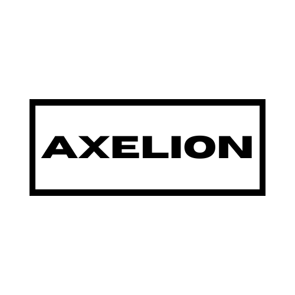

  <h1>AXELION-BOT</h1>

  
  

  

## INFO
This code is an implementation of [Baileys](https://github.com/WhiskeySockets/Baileys).
Use this script wisely, use common sense in utilizing existing technology.  
 

## WARNING
WhatsApp bot is still in the development stage, so there are a few bugs WhatsApp Connection (BETA, not working perfectly)
